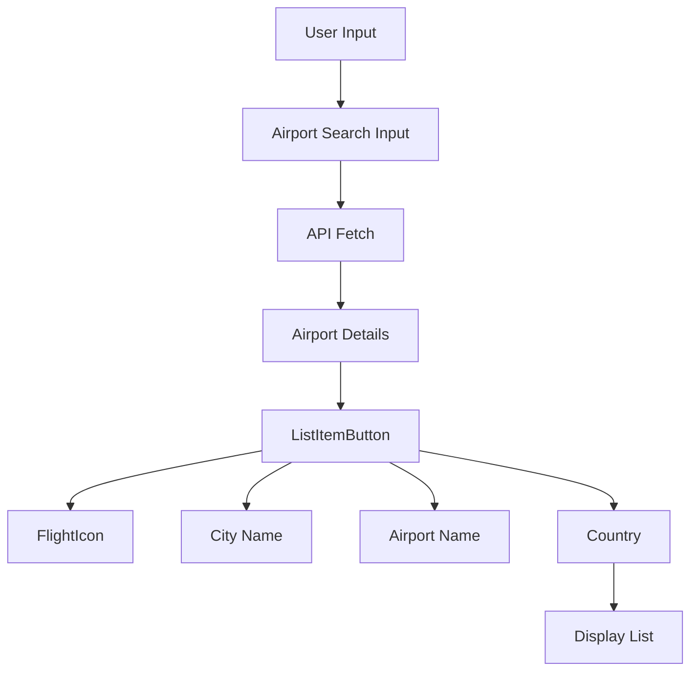

# FlightsFrom Component Details

## Symbols

- `airport`: State variable to store the user input for airport search.
- `airportDetail`: State variable to store the fetched airport details.
- `liData`: State variable to manage the state of ListItemButton.
- `setAriportFrom`: Function from `useAuth` context to set the selected airport details.

## State Variables

- `airport`: String state variable initialized to store the user input for airport search.
- `airportDetail`: Array state variable initialized to store the fetched airport details.
- `liData`: Boolean state variable initialized to manage the state of ListItemButton.
- `setAriportFrom`: Function from `useAuth` context to set the selected airport details.

## Functionality

- `handleChange`: Handles input change in the airport search input field (`onChange` event).
- `fetchData`: Fetches airport details from the API based on the user input (`useEffect` with dependency on `airport`).
- `handleLiData`: Sets the selected airport details using `setAriportFrom` and closes the component modal (`onclose` function).

## Connections with Other Components

- **Context**: Uses `useAuth` context to set the selected airport details (`setAriportFrom`).
- **ListItemButton**: Utilizes `ListItemButton` component from `@mui/material` to display airport details and handle selection.

## Output

- Renders a modal component (`div` with specific styling and input field for airport search).
- Displays a list of airports fetched from the API in `ul` with `ListItemButton` for each airport showing city, name, and country details.
- Allows selection of an airport which triggers `handleLiData` to set the selected airport details and close the modal.

# FlightsFrom Component Output Graph



```plaintext
This diagram provides a visual representation of how the FlightsFrom component functions and displays its output based on user interaction and data flow. Adjust the labels and connections as per the specific implementation and design of your component.
```

## This diagram illustrates the flow of data and components in the FlightsFrom component:

- **User Input**: User interacts with the component by typing into the airport search input.
Airport Search Input: Receives user input for airport search.
- **API Fetch**: Fetches airport details from the API based on the user input.
- **Airport Details**: Holds the data retrieved from the API (city, name, country).
- **ListItemButton** : Displays each airport as a clickable list item.
- **FlightIcon, City Name, Airport Name, Country**: Components of each ListItemButton showing respective details.
Display List: Renders the list of airports with FlightIcon, city, name, and country details.

